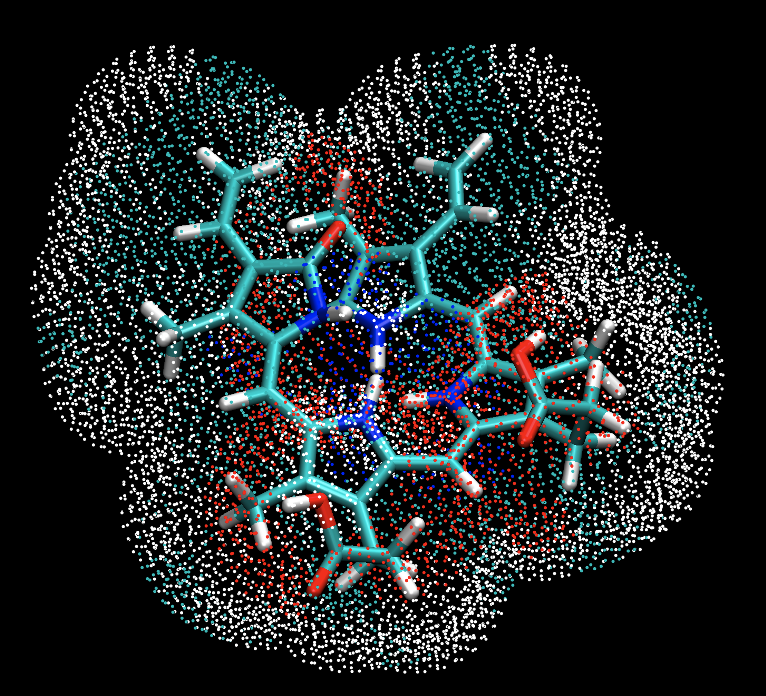

# biliresp

<p>
  
</p>

<p>
  <a href="https://github.com/emainas/biliresp/actions">
    
  </a>
  <a href="https://github.com/emainas/biliresp/actions/workflows/tests.yml">
    
  </a>
</p>

> **Status:** pre-release, under active development. Interfaces may change without notice.

Utilities for parsing electrostatic potential output (In [TeraChem](http://www.petachem.com/products.html) this is included in `resp.out`) and ESP grid (In [TeraChem](http://www.petachem.com/products.html) this is outputed as `esp.xyz`) files. The package supplies:

- 📄 A parser (`resp.ParseRespDotOut`) for extracting RESP frames and ESP grids from an ab initio Molecular Dynamics trajectory or QM/MM trajectory (or a single conformer calculation can be used).
- 🧮 A linear ESP charge fitting implementation (`linearESPcharges.linear`).
- 📊 Dipole post-processing helpers (`dipole.three_dipoles_for_frame`) and a mass-weighted center-of-mass calculator that reuses xyz element ordering.
- 🛠️ Command-line entry points in `scripts/` for quick comparisons.

## Documentation

Full documentation, including guides and API references, lives on the project site: [biliresp Docs](https://emainas.github.io/biliresp/getting-started/).

## Quick start 🚀

```bash
python -m venv .venv
source .venv/bin/activate
python -m pip install -e .
```

## Run the test suite ✅

```bash
PYTHONPATH=src pytest -s tests
```

Use `-k` to narrow to an individual module while iterating (for example `-k test_dipole`).

## Command-line entry points ⚙️

All commands assume the sample RESP outputs in `data/raw/` and 78 atoms; adjust to your system as needed.

```bash
# Compare RESP ESP charges to fitted charges
python scripts/compare_charges.py data/raw/resp.out data/raw/esp.xyz 78 --frame -1

# Print QM, ESP, and fitted dipoles for a frame
python scripts/print_dipoles.py data/raw/resp.out data/raw/esp.xyz data/raw/1.pose.xyz 78 --frame -1
```

Both scripts accept `--help` for a summary of arguments.

## Under development 🧪

1. Restraint ESP charges
2. Symmetry-adapted regression
3. Multiconformational RESP charges
