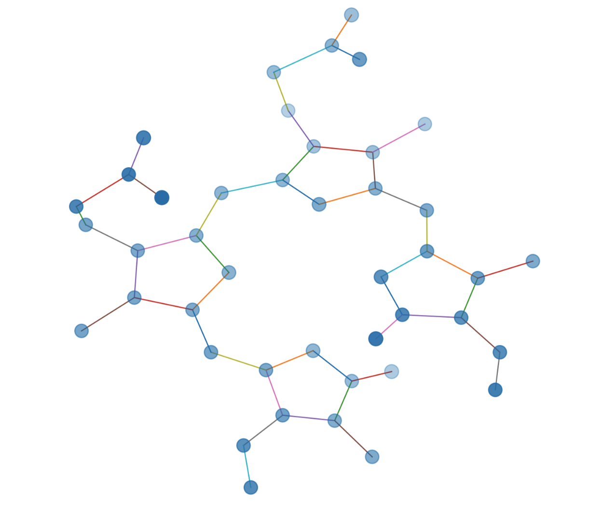

# Symmetry Analysis

The symmetry module converts molecular structures into `networkx` graphs and
applies Weisfeiler–Lehman (WL) refinement to discover atoms that share identical
local environments. This is particularly helpful when analysing RESP results,
because the buckets returned by the WL procedure highlight atoms that can share
constrained charges.

```python
from pathlib import Path

from symmetry import buckets_from_pdb

buckets = buckets_from_pdb(Path("data/raw/1.pose.pdb"), radius=10)
print(f"Identified {len(buckets)} equivalence classes")
```

Each bucket contains the indices of atoms that are indistinguishable after `r`
rounds of WL refinement. Increase `radius` when you need a deeper comparison of
atomic environments.

<figure>
  
  <figcaption>Hydrogen-less molecular network used for WL refinement.</figcaption>
</figure>

<figure>
  
  <figcaption>Detected symmetry buckets (radius 10).</figcaption>
</figure>

<figure>
  
  <figcaption>Detected symmetry buckets (radius 15).</figcaption>
</figure>

The figure above starts from the hydrogen-less network of the biliverdin
fragment. The colourings correspond to WL buckets evaluated at radii 10 and 15,
respectively.
