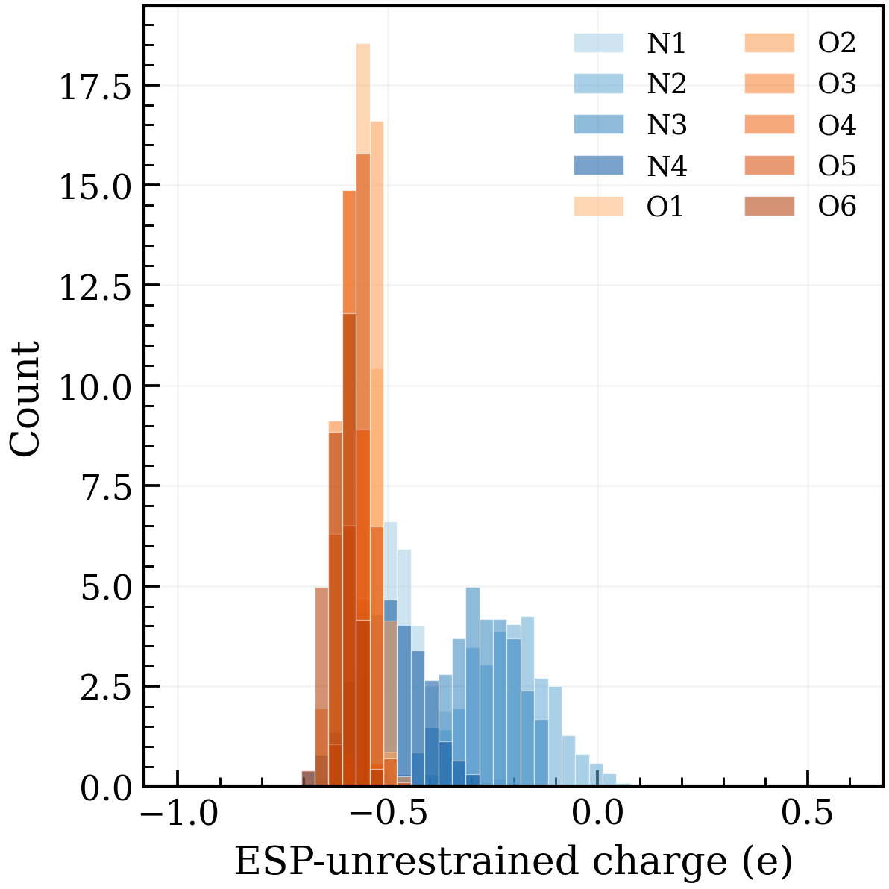
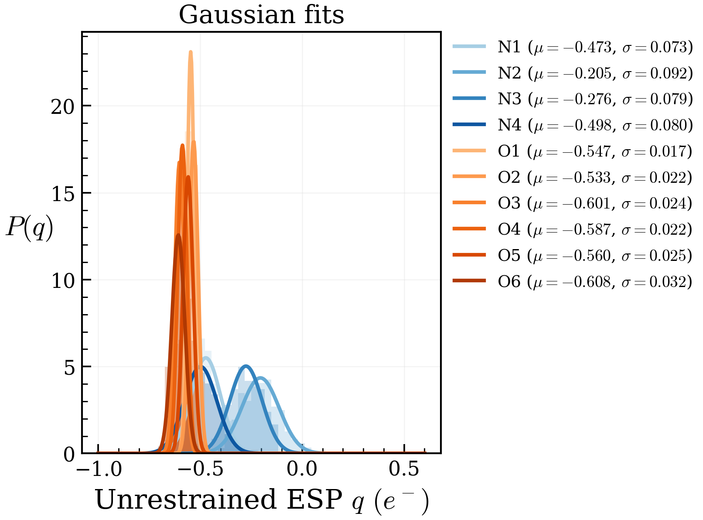

# ESP Charge Distributions

The notebook in `notebooks/` that accompanies this project aggregates the ESP-unrestrained charges from every frame in `resp.out`. Two views are especially useful when sanity-checking how individual atoms sample the RESP charge distribution throughout a trajectory.

## Per-atom histograms

The figure below overlays the histograms for every nitrogen (blue tones) and oxygen (orange tones) atom. Each trace corresponds to one atom index, so you can spot outliers or unusually broad distributions at a glance.

The compact support and narrow widths suggest that the ESP-unrestrained fit is stable across the frames considered.

## Gaussian fits

The same notebook fits a normal distribution to each atom’s samples and overlays the resulting curves. This makes it easy to compare the mean and spread across similar atoms.

The legend in the notebook lists the fitted mean (μ) and standard deviation (σ) for each atom, providing quick access to quantitative summaries that can be reused in downstream analyses.

