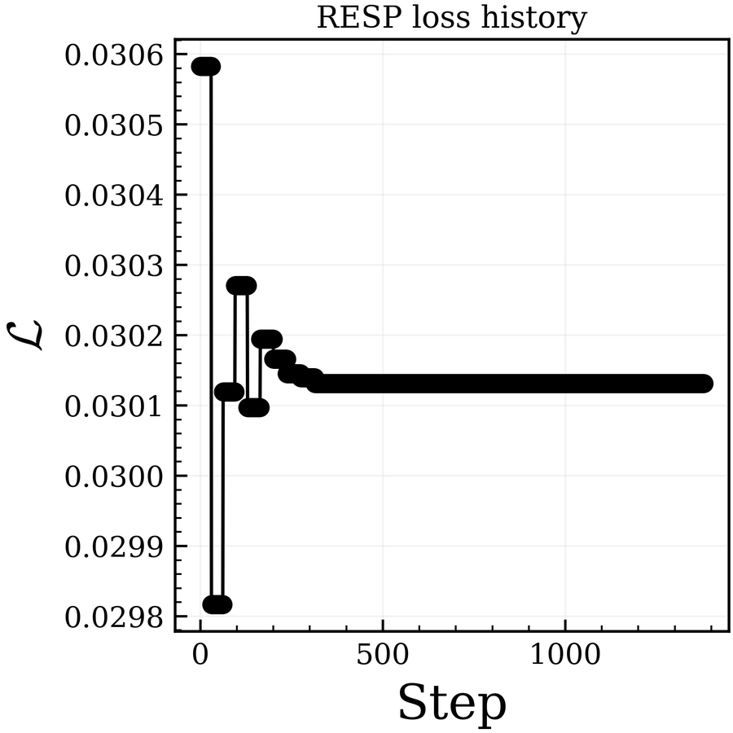

# RESP Hyperbolic Solver

The RESP workflow augments the linear ESP fit with a nonlinear, hyperbolic restraint that mirrors the setup used by TeraChem. All routines live in `resp.resp`, with `fit_resp_charges` acting as the main entry point.

## Objective and Restraint

Given a design matrix $A \in \mathbb{R}^{M \times N}$, ESP grid values $V \in \mathbb{R}^{M}$, and a target total charge $Q$, we minimise the penalised loss

$$
\mathcal{L}(q) = \|A q - V\|_2^2 + R(q),
$$

subject to charge conservation

$$
\mathbf{1}^\top q = Q.
$$

The restraint couples to a mask $m \in \{0,1\}^N$ that selects which atoms participate (all atoms by default):

$$
R(q) = a \sum_{i: m_i = 1} \left(\sqrt{(q_i - q_0)^2 + b^2} - b\right).
$$

Parameters $(a, b, q_0)$ form the `HyperbolicRestraint`. The gradient needed for optimisation is

$$
\frac{\partial R}{\partial q_i} =
\begin{cases}
a\,\dfrac{q_i - q_0}{\sqrt{(q_i - q_0)^2 + b^2}}, & m_i = 1,\\[1.2ex]
0, & m_i = 0.
\end{cases}
$$

## KKT System

Introducing a Lagrange multiplier $\lambda$ for the charge constraint yields the first-order optimality conditions

$$
\nabla_q \mathcal{L}(q) + \lambda \mathbf{1} = 0,
\qquad
\mathbf{1}^\top q - Q = 0,
$$

where $\nabla_q \mathcal{L}(q) = 2 A^\top (A q - V) + \nabla R(q)$.

Stacking the unknowns into $x = (q, \lambda)$ gives a nonlinear system

$$
F(x) =
\begin{bmatrix}
2 A^\top (A q - V) + \nabla R(q) + \lambda \mathbf{1} \\
\mathbf{1}^\top q - Q
\end{bmatrix}
= 0.
$$

## Newton–Krylov Solve

`fit_resp_charges` calls SciPy's `newton_krylov` on $F(x)$. The solver uses an initial guess $(q^{(0)}, \lambda^{(0)})$ built from the linear ESP solution and zero Lagrange multiplier. Each iteration:

1. Evaluates $F(x)$ and numerically approximates the Jacobian–vector product.
2. Solves for a correction using a Krylov subspace method.
3. Updates $x$ with the computed Newton step.

No line search is performed, so the loss history can oscillate slightly before convergence. Convergence is declared when the infinity norm of $F(x)$ drops below the requested tolerance.

## Diagnostics and Outputs

- The returned dictionary includes the fitted charges, Lagrange multiplier, loss breakdown (`loss`, `ls_term`, `restraint`), RMSE/RRMS, total charge information, the boolean restraint mask, and the running `loss_history`.
- `_loss_terms` evaluates the same objective outside the solver loop and is reused by the public API for consistency.
- `kkt_residual_at` re-computes $F(x)$ for any charge vector, making it easy to compare against reference data such as TeraChem outputs or to audit convergence criteria.
- `plot_loss_history` visualises `loss_history`. If `notebooks/prl.mplstyle` exists, it is applied automatically to keep project plots consistent; otherwise the Matplotlib defaults are used.



## Masking Behaviour

By default every atom is restrained. Passing `restrain_all_atoms=False` selects only heavy atoms, reproducing the legacy RESP convention. The solver stores the mask used in the `mask` entry of the result bundle.

## Usage Example

```python
from pathlib import Path
from resp.resp import HyperbolicRestraint, fit_resp_charges

resp_out = Path("data/raw/resp.out")
esp_xyz = Path("data/raw/esp.xyz")
geometry_xyz = Path("data/raw/1.pose.xyz")

restraint = HyperbolicRestraint(a=5e-4, b=1e-3, q0=0.0)
result = fit_resp_charges(
    resp_out,
    esp_xyz,
    geometry_xyz,
    number_of_atoms=78,
    frame_index=-1,
    restraint=restraint,
    restrain_all_atoms=True,
    save_loss_plot=True,
)

print(result["loss"], result["sum_q"])
```

This mirrors the workflow exercised in `tests/test_resp_solver.py`, where the fitted charges match the final RESP frame from TeraChem to within $10^{-5}$.
